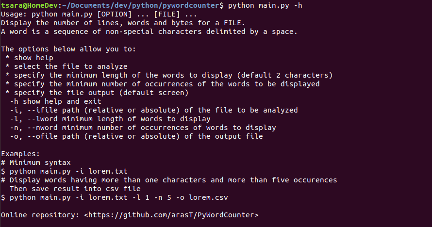
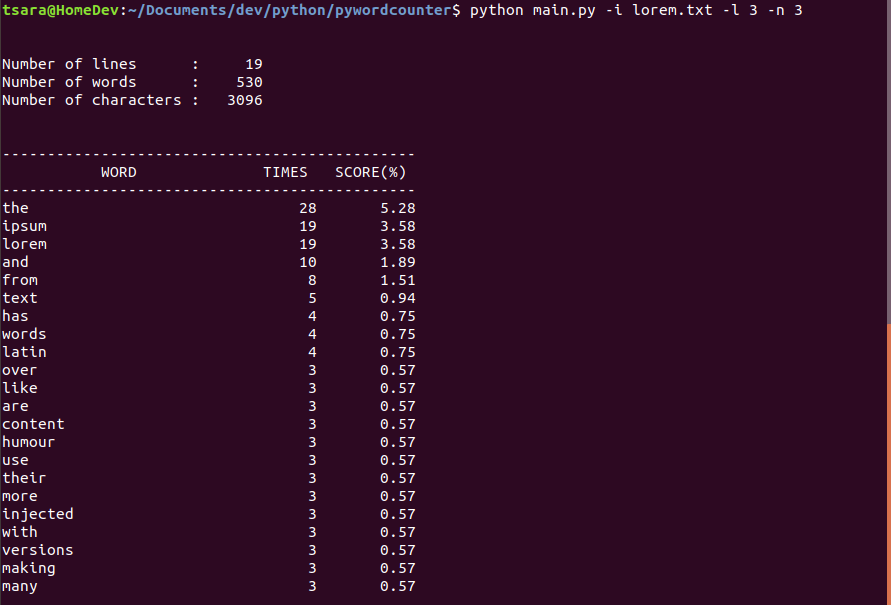
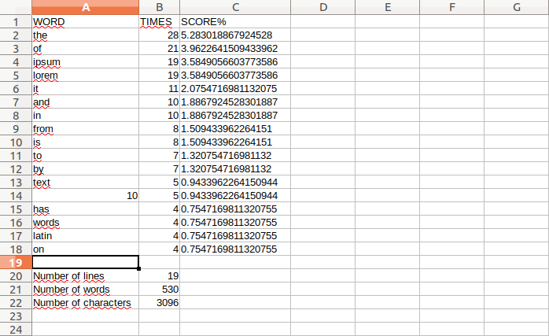

PyWordCounter
=========

Python script to display the number of lines, words and characters for a text file. And a table about number of each word is displayed and can be saved into a csv file.

Screenshots
---




How to use
---

This app is developped in [Python2.7](https://www.python.orAg/download/releases/2.7/).

Clone or Download this repository.
```
git clone https://github.com/arasT/PyWordCounter
```
Extract the archive and move into it.
```
cd PyWordCounter
```

Run
---
The minimal way to launch the script is to run the main script and indicate a text file.
```
python main.py -i lorem.txt
```
See more option by displaying help.
```
python main.py -h
```
For example: Display words having more than one character and appears more than five times.
  Then save result into csv file.
```
python main.py -i lorem.txt -l 1 -n 5 -o lorem.csv
```

License
----

The MIT License.
Further details see LICENSE file.


Contributing
----

Please fork if you want to contribut to this project.
